# Razorpay Revenue Recovery Agent

A simulated payment-recovery agent for the Razorpay AI Buildathon (Track 03 — AI Revenue Recovery), evaluated under a pre-registered, single-use holdout protocol. The headline result is a negative one — the candidate agent (A3-D) failed its pre-registered success criterion on holdout — and this repository exists to make that result, and the reasoning behind it, fully inspectable.

## The Problem

When a subscription payment fails, Razorpay's own systems retry the charge automatically on a fixed schedule the merchant cannot control (`EVAL.md §1.1`). What the merchant *can* still do is decide whether to contact the customer, when, on which channel, with which remedy, and when to stop (`EVAL.md §1.2`). Two outcomes are worth recovering, and they are not the same thing (`EVAL.md §1.3`):

- **Invoice recovery** — the specific failed charge gets paid, only possible while Razorpay's own auto-retries are still running.
- **Subscription rescue** — the subscription itself returns to `active`, even if that one invoice is lost.

The hard part is the tradeoff at the center of "contact": every message costs money and carries annoyance/cancellation risk, so a policy that contacts more isn't automatically better, and a policy that contacts less isn't automatically cheaper to run if it recovers meaningfully fewer invoices. Getting the remedy wrong (e.g. prompting a card update for a balance problem) helps no one either.

## What We Built

- **A synthetic simulator** (`src/rrx/sim/`) generating a population of failed-payment episodes from a frozen configuration (`configs/population.yaml`, `configs/episode.yaml`) — no real customer or merchant data anywhere in this project.
- **A pre-registered evaluation harness** (`src/rrx/harness/`, `src/rrx/eval/`) with frozen `dev`/`holdout`/`stress` splits, common-random-number pairing, and a paired-bootstrap statistical test.
- **Five recovery arms**, run over identical episodes and an identical 3-contact budget: `A0` (no contact, the floor), `A1` (naive fixed dunning), `A2-strengthened` (a competent, condition-aware fixed rulebook — the strongest non-agent baseline), `A3-D` (the deterministic candidate agent), and `A4` (an oracle with full hidden-state access — reference only, not a deployable comparator).
- **Contact controls and safety gates** (`src/rrx/agent/gate.py`) enforcing eight invariants from `EVAL.md §5.2` — no agent-initiated payment retries, no contact to terminal subscriptions, no mismatched remedies, budget caps, quiet hours, and more.
- **A per-tick audit ledger** (`src/rrx/agent/ledger.py`) recording every A3 decision with a structured rule id, reason code, and gate verdict.
- **A3-D**, the arm actually scored on holdout: a pure, deterministic, 16-rule decision table (`docs/A3-DESIGN.md §10A`) — no network call, no LLM, no randomness beyond the shared world draws every arm uses.
- **A3-LLM**, a development-only arm that used a live LLM (`gpt-5-mini`) to make the same decisions A3-D makes by rule. It was tuned and evaluated on `dev` only and never ran on `holdout` (see [AI / LLM Component](#ai--llm-component)).

## How It Works

```text
payment failure
  → decline classification (decline_code, e.g. insufficient_funds, card_expired)
  → EpisodeView (observable state only — no hidden/latent fields)
  → policy decision (A3-D's 16-rule table, or A3-LLM's prompted planner in dev)
  → safety gate (rules R1–R8, EVAL.md §5.2)
  → contact executor (send, or WAIT / STOP)
  → ledger record (one per tick: rule id, reason code, gate verdict, action)
```

`EpisodeView` (`src/rrx/features/episode_view.py`) is the agent's entire information boundary — ten fields (subscription state, invoice amount, days since first failure, auto-retry status, decline code, contact history, budget remaining). The agent never sees the simulator's hidden latent state; `tests/test_no_latent_leak.py` enforces this at both the import level and the rendered-prompt level.



Green = A3-D, the deterministic policy actually scored on the frozen holdout run. Red/dashed = A3-LLM and its dev-only evaluation surface — no edge to the "FROZEN HOLDOUT" box anywhere in this diagram, on purpose. Full legend and Mermaid source: [`docs/architecture/revenue-recovery-architecture.md`](docs/architecture/revenue-recovery-architecture.md).

## AI / LLM Component

Stated precisely, because this distinction matters for the submission:

- **A3-D — the arm that ran on `holdout` and is the subject of every result below — is not an LLM agent.** It is a deterministic, first-match-wins 16-rule table (`src/rrx/agent/policy.py`). It never calls an LLM and carries zero LLM cost on every recorded tick.
- **A3-LLM is the actual LLM-integrated arm.** It used `gpt-5-mini` via a real, live API integration (`src/rrx/agent/openai_client.py`, `planner.py`) during development.
- **Real live-API dev evidence exists.** Six tuning configurations (`GPT-C1`–`GPT-C6`) were each run for 500 dev episodes, with real ledger records — non-null model output, prompt hashes, token counts, and latencies (`results/tuning_log.md`).
- **A3-LLM did not receive the full-N confirmation run its own methodology prescribed.** The selected configuration (`GPT-C2`) was chosen on N=500 evidence; the prescribed N=2,000 full-dev confirmation was never executed (`EVAL.md §7.1` item B.1).
- **A3-LLM was never run on `holdout`, at all**, for a pre-declared budget reason decided before any holdout access (`EVAL.md §7.1` item A). No A3-LLM holdout figure exists, and none may be inferred from its dev result or from A3-D's holdout result.
- **No claim of LLM holdout uplift is made anywhere in this repository**, and none is made here.

## Evaluation

- **Pre-registered, frozen contract:** every success criterion, comparator rule, and statistical test was written and tagged (`eval-spec-v1.10`) before the one holdout run that judged them (`EVAL.md §7`).
- **`dev` vs. `holdout` separation:** `dev` (seeds 1000–2999) was used for all development and tuning; `holdout` (seeds 9000–10999, N=2,000) is single-use per candidate release (`EVAL.md §3.5`) and was accessed exactly once, through a guarded, tag-verified entry point.
- **Common-random-number pairing:** the same episode index presents an identical simulated world to every arm, so differences are attributable to decision quality, not luck (`EVAL.md §6`).
- **Primary metrics:** invoice recovery rate, subscription rescue rate. **Contact metrics:** total contacts, contacts per invoice recovered, contacts per subscription rescued.
- **Safety invariants:** eight `EVAL.md §5.2` counts (gate rejections, remedy mismatches, budget/quiet-hours violations, etc.) that must be exactly zero on every split.
- **Why holdout integrity matters:** the sealed holdout run is checksummed (`SHA256SUMS`) and tagged (`holdout-run-4d45db461943-sealed`) *before* any result was read, and it is single-use — there is no second chance to re-run it for this candidate if the number is unwelcome, which is the entire point of pre-registration.

## Results

Frozen `holdout` result (N=2,000 episodes per arm, seeds 9,000–10,999; `RESULTS.md`):

| Arm | Invoice recovery | Subscription rescue | Total contacts |
| --- | ---: | ---: | ---: |
| A0 | 0.3585 | 0.3920 | 0 |
| A1 | 0.4640 | 0.4890 | 3,778 |
| A2-strengthened | 0.4685 | 0.5190 | 3,626 |
| **A3-D** | **0.4425** | **0.5085** | **2,871** |
| A4 (oracle reference) | 0.5245 | 0.5445 | 3,076 |

**A3-D failed criterion 2 on holdout.** On both primary metrics, A3-D scored significantly *below* its statistically-determined comparator set (A1 and A2-strengthened on invoice recovery; A2-strengthened alone on subscription rescue), with 95% confidence intervals excluding zero in A3-D's unfavorable direction (`RESULTS.md §7`).

- **It passed the safety criterion** — all eight safety invariants were zero on `dev`, `holdout`, and `stress` (`RESULTS.md §10`).
- **It passed contact discipline** — fewer total contacts and a better contacts-per-outcome ratio than every comparator (`RESULTS.md §8`) — but this is moot given criterion 2's failure.
- **The recovery deficit was statistically unfavorable, not a near-miss:** every comparator-set difference excluded zero in A3-D's disfavor.

This is not spun as a success. `EVAL.md §7` itself pre-committed to this outcome: *"if A3 cannot beat the best-performing bounded arm at equal contact budget, we report that... We do not re-tune until the number looks good."* No parameter, prompt, or threshold was changed after this result was observed, and no second holdout run exists or will exist for this candidate.

## What We Learned

Post-hoc diagnostic analysis of the sealed holdout artifacts (Day 9, `docs/analysis/`) — descriptive, not a new evaluation, and it changes nothing about the result above:

1. **A3-D's restraint reduced contacts substantially** — 2,871 vs. 3,626–3,778 for the comparators, a 21–24% reduction.
2. **That contact reduction did not economically compensate for the lost invoice recovery.** Under the registered cost model, the break-even contact cost needed to justify the tradeoff is roughly 83×–199× the actual registered cost (`docs/analysis/DAY9-NET-VALUE.md`'s earlier bracketed estimate) — since measured precisely at **139× vs. A1** and **212× vs. A2-strengthened** (`docs/analysis/DAY10-VALUE.md`).
3. **The dominant loss mechanism was A3-D's day-3 withhold predicate** — a within-episode adaptive-contact rule that declines a second contact after two unengaged observations, in episodes where the comparator's own (unconditional or differently-timed) contact went on to recover the invoice (`docs/analysis/DAY9-DECOMPOSITION.md`).
4. **Against A2-strengthened, 59/59 comparator-only recoveries traced to exactly this mechanism** — a complete, single-cause explanation for that comparator's entire deficit.
5. **STOP was not the cause.** Zero of A3-D's 311 holdout STOP actions overlapped with a lost-recovery episode against either comparator — the deficit is driven by declined contacts (WAIT), not active disengagement.
6. **Remedy matching was 100% among contacts A3-D actually sent** — 0 mismatches across 2,871 holdout contacts. The deficit is about contacts not sent, never a wrong remedy on a contact that was sent.
7. **A dev-only sweep of the withhold threshold found a non-dominated setting.** A less restrictive threshold (`≥3`, vs. the frozen `2`) beat A1 outright on `dev` (higher recovery, higher rescue, *fewer* contacts) and improved on A2-strengthened on both primary metrics, backed by a paired-bootstrap CI excluding zero (`docs/analysis/DAY9-FRONTIER.md`).
8. **That threshold result is dev-only and was never holdout-validated.** `holdout` was not re-accessed to test it, cannot be re-accessed for this candidate, and no claim is made that it would replicate.
9. **Taken together, this is evidence of parameter sensitivity, not evidence that a different threshold is a proven replacement.** A3-D's own architecture, at a different point in its reachable behavior, compared favorably to the bounded baselines on `dev` — which argues against a purely structural ceiling — but nothing here reopens, revises, or substitutes for the sealed holdout verdict above.

## Safety and Failure Handling

- **Gate invariants:** all eight `EVAL.md §5.2` rows (R1–R8) are implemented (`src/rrx/agent/gate.py`) and independently tested (`tests/test_gate_rules.py`); every count was zero on `dev`, `holdout`, and `stress`.
- **STOP, contact budget, and fallback behavior** are implemented and ledger-recorded; STOP fired 311 times on holdout, all correctly logged with a rule id and reason code.
- **API timeout, unparseable output, schema violation, and gate rejection** are each demonstrated end-to-end against the real runner with a real ledger record (`tests/test_a3_llm_forced_failure_parity.py`, `tests/test_planner_fallback_ledger.py`, `tests/test_gate_rejection_fallback.py`) — injected against a stubbed planner, not a live API call.
- **Budget exhaustion is structurally enforced** (the runner cannot call the policy once the budget is spent) but **does not currently have a dedicated runtime test** that proves this through the live runner rather than by code inspection.
- **Mid-episode state change (stale state) is specified but not implemented** — three separate proofs confirm it is architecturally unreachable in the current simulator, not that it has been handled and tested.

Not every failure mode is runtime-tested; the two above are honestly the exception, not the rule. Full detail: `LIMITATIONS.md §2`, `docs/analysis/DAY9-BAR-COMPLIANCE.md §7`.

## Repository Map

| Document | Contents |
| --- | --- |
| [`EVAL.md`](EVAL.md) | The frozen evaluation specification — population, metrics, success criteria, splits |
| [`RESULTS.md`](RESULTS.md) | The sealed holdout result, criterion-by-criterion |
| [`LIMITATIONS.md`](LIMITATIONS.md) | Full, honest limitations record across five categories |
| [`ARCHITECTURE.md`](ARCHITECTURE.md) | System architecture, data flow, module map |
| [`docs/PITCH.md`](docs/PITCH.md) | Buildathon pitch and demo script |
| [`docs/A3-DESIGN.md`](docs/A3-DESIGN.md) | A3-D/A3-LLM design freeze — decision table, gate mapping, failure injection |
| [`docs/analysis/DAY9-NET-VALUE.md`](docs/analysis/DAY9-NET-VALUE.md) | Post-hoc break-even economic analysis |
| [`docs/analysis/DAY9-DECOMPOSITION.md`](docs/analysis/DAY9-DECOMPOSITION.md) | Episode-level recovery-deficit decomposition and mechanism attribution |
| [`docs/analysis/DAY9-FRONTIER.md`](docs/analysis/DAY9-FRONTIER.md) | R-16 adjudication and the dev-only restraint-threshold frontier |
| [`docs/analysis/DAY9-BAR-COMPLIANCE.md`](docs/analysis/DAY9-BAR-COMPLIANCE.md) | Independent submission-readiness audit |
| [`results/holdout/4d45db461943/`](results/holdout/4d45db461943/) | Sealed holdout artifacts, checksummed |
| [`results/audit_sample/`](results/audit_sample/) | Mechanically-selected, committed A3-D holdout ledger excerpt |
| [`results/tuning_log.md`](results/tuning_log.md) | Every A3-LLM tuning configuration tried, including losing ones |
| [`CHANGELOG.md`](CHANGELOG.md) | The full amendment history of the evaluation spec, append-only |

## Reproducing Development Results

```bash
pip install -e ".[dev]"     # Python >= 3.13; installs pytest, ruff, and offline test scaffolding

pytest -q                   # or: make test
ruff check .                # or: make lint

python -m rrx.eval.runner   # or: make eval — runs the default A3-D dev cohort
```

The Day 9 diagnostic scripts are dev-only and read-only against the sealed holdout artifacts; each is reproducible directly:

```bash
python scripts/day9_decompose.py
python scripts/day9_mechanism_attribution.py
python scripts/day9_frontier.py             # dev-only threshold sweep; never touches holdout
```

**Known limitation:** `EVAL.md §6` documents reproduction via `make eval RUN=<run_id>`, but the current `Makefile`/`rrx.eval.runner` do not accept a `RUN` parameter — `make eval` always runs the one hardcoded default cohort. `make sweep` similarly does not accept the `--sweep` flag it's defined to pass. Both are pre-existing, disclosed defects (`LIMITATIONS.md §4.2`), not fixed here.

**Holdout is not something to reproduce by rerunning.** It is single-use per candidate release and has already been consumed for this candidate (`scripts/run_holdout.py` is guarded and will refuse a second run). To verify the sealed result instead of rerunning it: `sha256sum -c results/holdout/4d45db461943/SHA256SUMS`.

## Current Limitations

- A3-D underperformed its comparator set on holdout — this is the headline result, not a limitation to a headline result.
- A3-LLM has no holdout result of any kind, and none may be inferred.
- GPT-C1–C6 tuning evidence is N=500-only, with a disclosed, unresolved methodology-authorization question against the original tuning budget.
- Sensitivity analysis is 0/26 cells complete.
- Two failure modes (budget exhaustion, mid-episode state change) are structurally handled or architecturally unreachable rather than runtime-tested.
- One decision-table default-fallthrough case (`R-16` for `ambiguous_decline` on day 3) is design-ambiguous rather than confirmed intentional.
- An aggregate ₹-recovered headline figure now exists (`RESULTS.md §14.1`, `docs/analysis/DAY10-VALUE.md`) — a **post-hoc descriptive aggregation** of the sealed holdout artifacts, **not** a pre-registered `EVAL.md §7` metric, and carrying **no confidence interval**.

Full detail, including severity classification for each item: [`LIMITATIONS.md`](LIMITATIONS.md), [`docs/analysis/DAY9-BAR-COMPLIANCE.md`](docs/analysis/DAY9-BAR-COMPLIANCE.md).

## Status

**Status: research prototype / buildathon submission candidate.**

The frozen holdout result (`RESULTS.md`) is sealed, checksummed, and preserved exactly as observed — it will not be re-run, re-tuned, or reinterpreted for this candidate. Everything under `docs/analysis/DAY9-*` is exploratory, dev-only diagnostic work performed *after* sealing, kept clearly separate from — and without authority to revise — the sealed result it explains.
