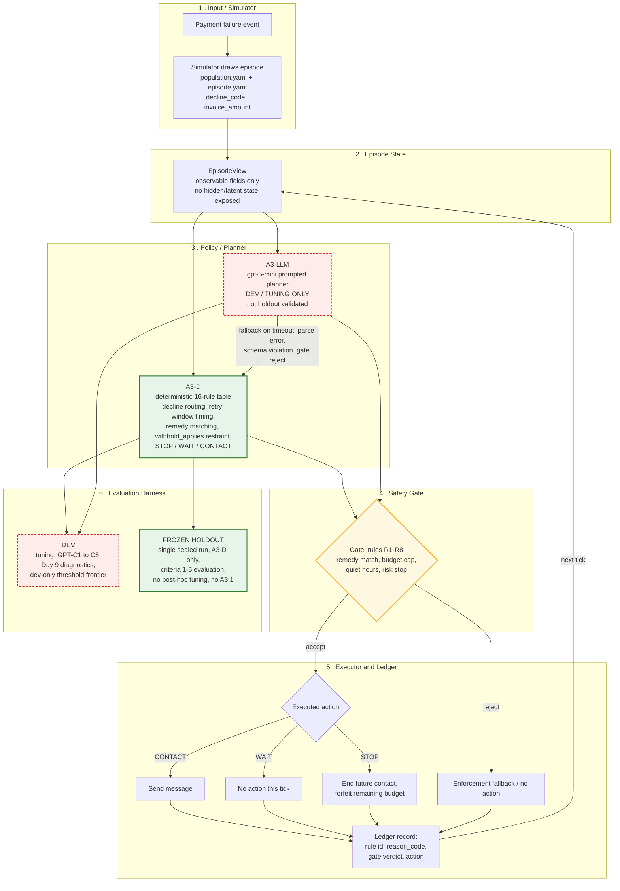

# Revenue Recovery — Architecture Diagram

Renders natively on GitHub. Editable Mermaid source (identical diagram body): [`revenue-recovery-architecture.mmd`](revenue-recovery-architecture.mmd). Pre-rendered image: [`revenue-recovery-architecture.svg`](revenue-recovery-architecture.svg) (generated from the `.mmd` file via `@mermaid-js/mermaid-cli`).

## Legend

- **Green, solid border** — part of A3-D, the deterministic policy actually scored on the frozen holdout run (`RESULTS.md`).
- **Red, dashed border** — A3-LLM and its evaluation surface: development/tuning only. A3-LLM has no edge to the "FROZEN HOLDOUT" box anywhere in this diagram, on purpose — it never ran on holdout (`EVAL.md §7.1` item A).
- **Yellow** — the safety gate (`src/rrx/agent/gate.py`, rules R1–R8, `EVAL.md §5.2`), the single chokepoint both A3-D and A3-LLM proposals pass through before anything is executed.

## Notes

- Grounded in `ARCHITECTURE.md` §2–§4 and `docs/A3-DESIGN.md` §10A; no component here is invented.
- **A0, A1, A2-strengthened, and A4 are intentionally not drawn.** They share the simulator via a simpler `(opening_condition_key, day, subscription_state) -> action` interface with no `EpisodeView`, gate, or ledger (`ARCHITECTURE.md` §2) — a materially different, simpler path than the one this diagram shows. This diagram covers the A3-D / A3-LLM path only.
- The `A3-D → FROZEN HOLDOUT` edge represents the one sealed, single-use holdout run this candidate has (`results/holdout/4d45db461943/`). It does not imply repeated or ongoing holdout access, and the `A3-D → DEV` edge is a separate, uncapped surface (dev runs, stress runs, Day 9 diagnostics — none of which touch holdout).
- This diagram does not depict the Day 9 dev-only restraint-threshold frontier (`docs/analysis/DAY9-FRONTIER.md`) as a distinct policy variant — that sweep used a parameterized copy of the decision table kept entirely outside `src/rrx/agent/`, never the shipped `A3-D` box shown here, and is not a deployed or holdout-evaluated configuration.
